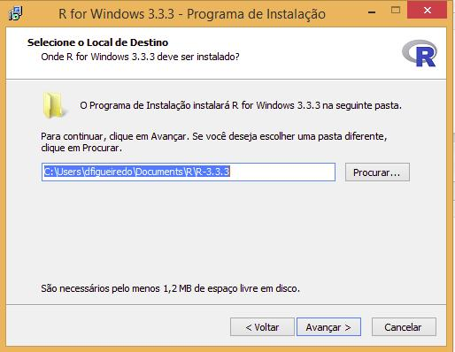

# 1) Instalando o R

## Windows

* Acesse o [link](https://cran.r-project.org/bin/windows/base/) e aparecerá a tela abaixo

```{r echo=FALSE, fig.align='center', out.width="90%"}
knitr::include_graphics("img/imagem_r.jpeg")
```

---
* Você pode salvar o arquivo em qualquer pasta, aqui vamos salvar na pasta Downloads

```{r echo=FALSE, fig.align='center', out.width="70%"}
knitr::include_graphics("img/downdloads_windows.jpeg")
```

Fonte: [Curso-R](https://www.curso-r.com/material/instalacao/)

---
* Clique no arquivo duas vezes com o botão esquerdo. Ele pedirá para você selecionar a linguagem da instalação. Escolha um idioma e clique em “OK”.

* Clique em “Avançar” até chegar na tela da imagem abaixo. Nessa etapa, você precisará escolher a pasta de instalação. Se você escolher um local que não está dentro da pasta do seu usuário, você precisará de acesso de administrador. Se escolher uma pasta dentro do seu usuário (como na imagem abaixo), não precisará.

```{r echo=FALSE, fig.align='center', out.width="65%"}

```

Fonte: [Curso-R](https://www.curso-r.com/material/instalacao/)

---
* Clique em avançar até chegar na tela abaixo:

```{r echo=FALSE, class='middle', fig.align='center', out.width="70%"}

```

Fonte: [Curso-R](https://www.curso-r.com/material/instalacao/)

Pronto! Você já tem o **R** na sua máquina!

---
## Linux

Abra uma janela de terminal e execute:

```{bash eval=FALSE, warning=FALSE, error=FALSE}
sudo apt-get install r-base r-base-dev
```

- A seguir digite sua senha e aguarde o R ser instalado

- Após a instalação, é sempre indicado atualizar seu sistema. Execute no terminal:

```{bash eval=FALSE, warning=FALSE, error=FALSE}
sudo apt-get update
sudo apt-get upgrade
```

---
## Linux - Distribuição Ubuntu

* Para Ubuntu, uma forma alternativa de instalação é acessar este [link](https://cran.r-project.org//), selecionar Linux e você será direcionado para uma página com a figura abaixo. 

```{r echo=FALSE, fig.align='center', out.width="70%"}
knitr::include_graphics("img/linux.jpeg")
```

* Escolha a sua distribuição de Linux e baixe o arquivo

* Abra o arquivo baixado e siga as instruções para instalação

---
## MAC
* Acesse esse [link](https://cran.r-project.org//), selecione MAC e você será direcionado para uma página com a figura abaixo. 

```{r echo=FALSE, fig.align='center', out.width="100%"}

```

* Escolha a versão do seu sistema operacional MAC OSX e siga as instruções para instalação

---
# 2) Instalando o R-Studio
## Windows
* Acesse o [link](https://www.rstudio.com/products/rstudio/download/)

```{r echo=FALSE, fig.align='center', out.width="80%"}
knitr::include_graphics("img/rstudio.jpeg")
```

* Role a tela até o final para encontrar as seguintes opções:

---
a. Se você tiver acesso administrador, baixe a versão que está na lista de Installers for *Supported Platforms*. Em seguida a instalação será bem simples: fazer o download, abrir o instalador e seguir as instruções clicando no botão “Avançar”.

```{r echo=FALSE, class='center', fig.align='center', out.width="90%"}

```

---
b. Se você não tiver acesso de administrador, faça o download da versão que está na lista Zip/Tarballs.

```{r echo=FALSE, fig.align='center', out.width="90%"}
knitr::include_graphics("img/zip.jpeg")
```

---
Se você for o **administrador**

2a. Clique duas vezes no arquivo que você baixou da página do RStudio (ver imagem abaixo) e siga as instruções de instalação.

```{r echo=FALSE, fig.align='center', out.width="60%"}
knitr::include_graphics("img/instalandoadmwindows.jpeg")
```

Fonte: [Curso-R](https://www.curso-r.com/material/instalacao/)

---
Se você **não** for o **administrador**

2b. Se você não for administrador, você deve ter feito o download de um arquivo do tipo .zip, que contém o código do RStudio. É o arquivo selecionado na imagem abaixo.

```{r echo=FALSE, fig.align='center', out.width="60%"}
knitr::include_graphics("img/instalandonoadmwindows.jpeg")
```

Fonte: [Curso-R](https://www.curso-r.com/material/instalacao/)

---
* Clique com o botão direito neste arquivo e depois em Extrair Tudo conforme a imagem.

```{r echo=FALSE, fig.align='center', out.width="70%"}
knitr::include_graphics("img/extrai.jpeg")
```

Fonte: [Curso-R](https://www.curso-r.com/material/instalacao/)

---
* Você verá uma tela como a imagem a seguir. Não mude nada e clique em extrair. Espere o Windows completar a extração.

```{r echo=FALSE, fig.align='center', out.width="70%"}
knitr::include_graphics("img/pastas.jpeg")
```

---
class: middle
* Agora na pasta Downloads, a pasta que deixamos como local de extração, você terá uma pasta chamada: **RStudio-1.0.136**. Abra essa pasta e entre na subpasta com nome **bin**.

* Procure pelo arquivo chamado rstudio e clique duas vezes. Isso abrirá o RStudio. ***Sugestão:*** fixe o programa na barra de tarefas para não ter que ficar procurando nessa pasta sempre que quiser abri-lo.

**Observação:**  se você excluir a pasta que extraímos, o RStudio irá parar de funcionar.

---
## Linux 
* Acesse o [link](https://www.rstudio.com/products/rstudio/download/)

```{r echo=FALSE, fig.align='center', out.width="100%"}
knitr::include_graphics("img/rstudio.jpeg")
```

---
* Role a tela até o final para encontrar as opções de sistema operacional

```{r echo=FALSE, fig.align='center', out.width="70%"}
knitr::include_graphics("img/instalandoadmwindows.jpeg")
```

* Escolha o seu sistema operacional

---
- Agora no terminal, vá para a pasta de Downloads. A seguir, instale o RStudio.

```{bash eval=FALSE, warning=FALSE, error=FALSE}
cd <caminho da pasta Downloads>
sudo dpkg -i rstudio.*
sudo apt-get install -f
```

- Após a instalação, é sempre indicado atualizar seu sistema. Execute no terminal:

```{bash eval=FALSE, warning=FALSE, error=FALSE}
sudo apt-get update
sudo apt-get upgrade
```

---
## Linux - Distribuição Ubuntu
* Para Ubuntu, um forma de alternativa é instalar com o arquivo baixado. Abra o arquivo e siga as instruções que aparecerem na tela 

```{r echo=FALSE, fig.align='center'}

```

---
## MAC
* Acesse o [link](https://www.rstudio.com/products/rstudio/download/)

```{r echo=FALSE, fig.align='center', out.width="100%"}
knitr::include_graphics("img/rstudio.jpeg")
```

---
* Dê ok e siga as instruções que aparecerem na tela 

```{r echo=FALSE, fig.align='center', out.width="100%"}
knitr::include_graphics("img/mac.jpeg")
```

---
# Referências
* [Curso-R](https://www.curso-r.com/material/instalacao/)
* [R](https://www.r-project.org/)
* [R-Studio](https://www.rstudio.com/)